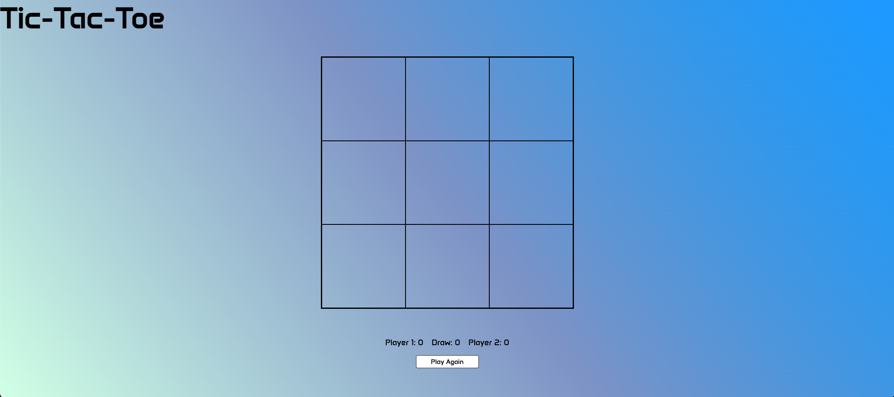

# ticTacToe

A simple 2-player browser-based game built with JavaScript, HTML, and CSS.

This is a browser-based implementation of the classic Tic Tac Toe game. The game features a clean UI, turn-based play for two players, win and draw detection, score tracking, and a reset option.

I built this project to practice:
	•	JavaScript module patterns (factory functions and closures)
	•	DOM manipulation
	•	Event handling
	•	Game state management
	•	Basic responsive design and layout using Flexbox

    🚀 How to Play
	1.	Player 1 (X) and Player 2 (O) take turns clicking on the board.
	2.	The first player to align 3 of their marks horizontally, vertically, or diagonally wins.
	3.	A draw is declared if the board fills up with no winner.
	4.	Click Play Again to reset the board and keep playing — scores will persist.

